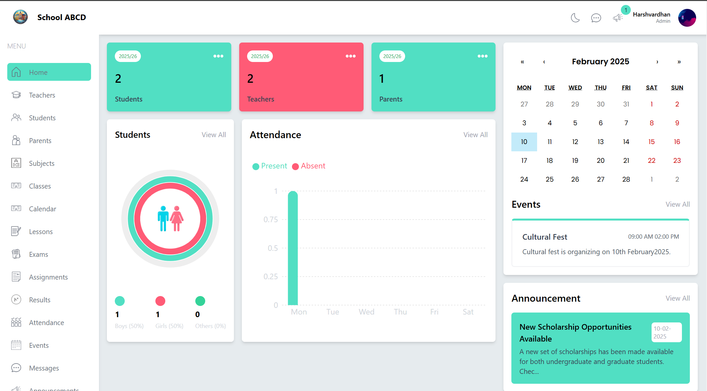
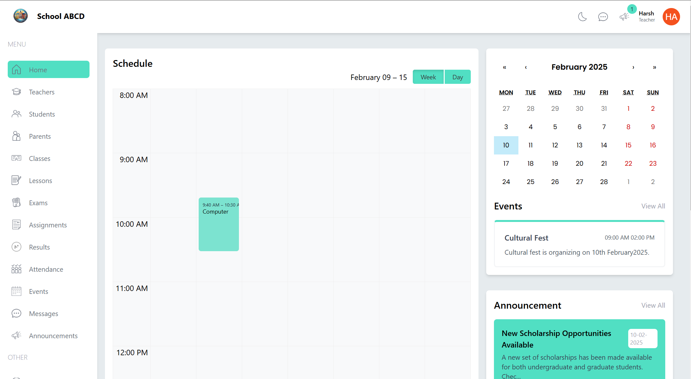
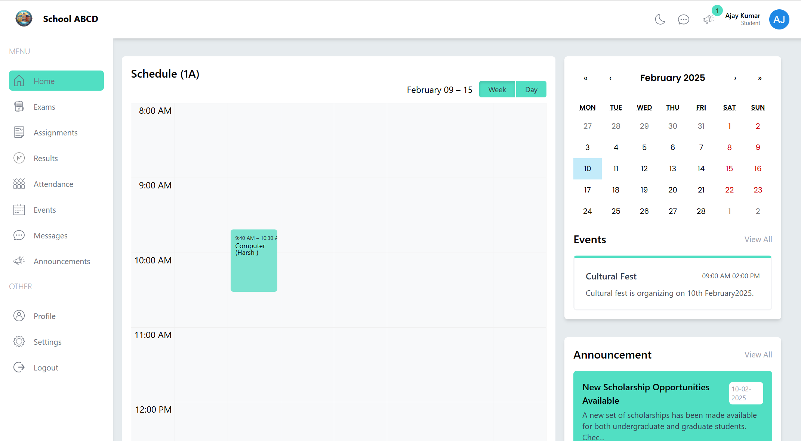
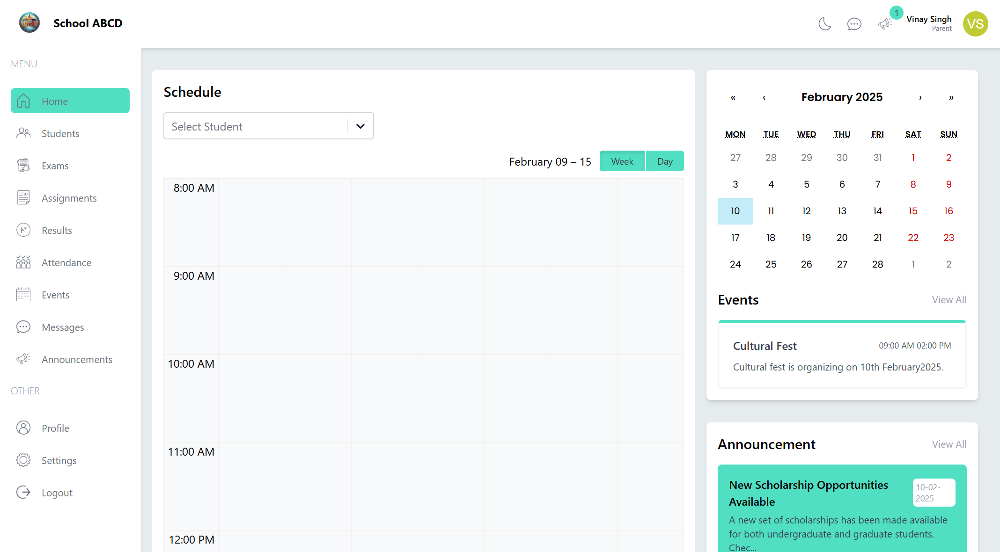

# School Management System

## Project Overview

The **School Management System** is a comprehensive web application designed to streamline the management of school operations. Built using the MERN stack, the system features four distinct roles: Admin, Teacher, Student, and Parent. Each role has specific functionalities tailored to their needs, creating a seamless experience for managing day-to-day school activities.

### Key Features:

- **Admin**:
  - Manage Teachers, Students, Parents, Classes, Subjects, Calendar (Timetable), Lessons, Exams, Assignments, Results, Attendance, Events, Messages, and Announcements.
  
- **Teacher**:
  - Create and manage Lessons, Assignments, Results, Attendance records, Events, Messages, and Announcements.
  
- **Student**:
  - View Exams, Assignments, Results, Attendance, Events, Messages, and Announcements.
  - Edit profile details.
  
- **Parent**:
  - View details about their children, such as Exams, Assignments, Results, Attendance, Events, Messages, and Announcements.
  - Edit profile details.
  
- **Email Notifications**:
  - Integrated with `smtp.gmail.com` for sending emails to users, including login credentials and notifications.
  
- **Profile Picture Upload**:
  - Integrated with Cloudinary for uploading and managing profile pictures.
  
- **Form Validation**:
  - Powered by `react-hook-form` and Zod for efficient and secure form validation.
  
- **Dynamic Tables**:
  - Utilizes the `useTable` hook for displaying and managing data interactively.
  
- **Dark Mode**:
  - Built-in dark mode toggle for users to switch between light and dark themes for a better visual experience.

## Table of Contents
- [Project Setup](#project-setup)
- [Usage](#usage)
- [Folder Structure](#folder-structure)
- [Technologies Used](#technologies-used)
- [Environment Variables](#environment-variables)
- [Screenshots](#screenshots)

## Project Setup

To get started with the School Management System, follow these steps:

### Prerequisites

Ensure you have the following installed:

- [Node.js](https://nodejs.org/) (v14 or higher)
- [npm](https://www.npmjs.com/) (Node Package Manager)
- A MongoDB cluster (local or cloud-based)

### Installation

1. **Clone the repository:**
   ```bash
   git clone https://github.com/Harshvardhan32/School-Management-System.git

2. **Install dependencies:**
   ```bash
   cd School-Management-System
   npm install
   
3. **Set up environment variables:** Create a .env file in the root directory of server folder and add the following variables:
   ```bash
   # Port
   PORT = 4000
   
   # MongoDB
   DATABASE_URL=mongodb+srv://<username>:<password>@cluster.mongodb.net/school-db

   # JWT Secret
   JWT_SECRET=your-jwt-secret-key

   # Cloudinary
   CLOUD_NAME=your-cloudinary-cloud-name
   API_KEY=your-cloudinary-api-key
   API_SECRET=your-cloudinary-api-secret

   # Email
   MAIL_HOST=smtp.gmail.com
   MAIL_USER=your-email@gmail.com
   MAIL_PASS=your-email-app-password

4. **Run the application:**
   ```bash
   npm run dev

## Usage

### **Admin Dashboard**
- Manage teachers, students, parents, classes, subjects, and school operations efficiently.
- Create and monitor calendars (timetables), exams, assignments, results, attendance, events, messages, and announcements.

### **Teacher Dashboard**
- Create and manage:
  - Lessons
  - Assignments
  - Exam Results
  - Attendance records
  - Events, Messages, and Announcements

### **Student Portal**
- View essential school-related information:
  - Exams, Assignments, Results, Attendance, Events, Messages, and Announcements.

### **Parent Portal**
- View and manage their child's academic and activity records, including:
  - Exams, Assignments, Results, Attendance, Events, Messages, and Announcements.

### **Email Notifications**
- **Automatic Emails**:
  - Account creation details (e.g., UserID and Password) are sent to users.

## Folder Structure

The project has the following folder structure:

    School-Management-System/
    ├── frontend/
    │   ├── public/               # Public assets such as favicon etc.
    │   ├── src/
    │   │   ├── assets/           # Static files like images, icons.
    │   │   ├── components/       # Reusable React components used throughout the app.
    │   │   ├── data/             # Static data files
    │   │   ├── pages/            # Pages for Admin, Teacher, Student, and Parent views.
    │   │   ├── reducers/         # Reducers for state management.
    │   │   ├── services/         # API services for interacting with the backend.
    │   │   ├── slices/           # Redux Toolkit slices for state management.
    │   │   ├── utils/            # Utility functions and helpers.
    │   │   ├── App.jsx           # Main application component.
    │   │   ├── index.css         # Global CSS styles.
    │   │   └── main.jsx          # Entry point of the React application.
    │   └── index.html            # HTML template for the app.

    ├── server/
    │   ├── config/               # Configuration files (e.g., database connection, cloudinary services).
    │   ├── controllers/          # Backend logic for handling API requests.
    │   ├── mail/                 # mail templates.
    │   ├── middlewares/          # Middleware functions (e.g., authentication, authorization).
    │   ├── models/               # MongoDB models for the database schema.
    │   ├── router/               # API route definitions.
    │   ├── utils/                # Utility functions and helpers for the backend.
    │   ├── .env                  # Environment variables for sensitive information.
    │   └── index.js              # Entry point for the backend server.

## Technologies Used

### Frontend
- **React.js**: Used for building an interactive and dynamic user interface.
- **React-Hook-Form**: For efficient form handling and validation.
- **Zod**: Schema-based validation library for ensuring accurate and safe form inputs.
- **Tailwind CSS**: Utility-first CSS framework for clean, responsive, and consistent styling.
- **React Router**: Enables seamless navigation and routing between different pages (e.g., Admin, Teacher, Student, Parent).
- **React Icons**: Provides a wide range of customizable icons for enhancing the UI, such as dark mode toggle icons.

### Backend
- **Node.js**: JavaScript runtime for server-side scripting and building scalable applications.
- **Express.js**: Lightweight framework for building RESTful APIs and server-side logic.
- **MongoDB**: A NoSQL database for efficient storage and retrieval of application data.

### Other Tools
- **Cloudinary**: Used for seamless profile picture uploads and media management.
- **JWT (JSON Web Tokens)**: For secure authentication and role-based access control.
- **SMTP (smtp.gmail.com)**: Configured to send email notifications for user account creation and updates.

## Screenshots

Here are some screenshots of the School Management System in action:

### Admin Dashboard


### Teacher Dashboard


### Student Dashboard


### Parent Dashboard
